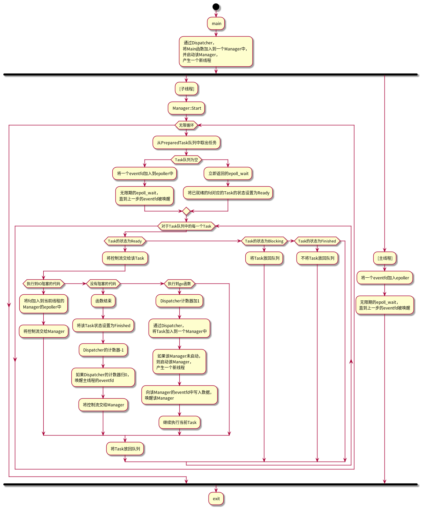

# liblily

适用于`linux`的协程库，使用`boost.context``[1.70.0]`。

编译器至少需要支持`C++11`。

## 主要特性

### go

模拟golang的`go`：

```C++
int i1 = 1024;
go([i1](int i2){
  std::cout << i1 + i2 << std::endl;
});
```

### channel

模拟golang的`chan`：

使用`operator<<`将数据送入`channel`，使用`operator()`取出数据，或使用`operator>>`取出数据并赋值给一个变量。

```C++
auto ticker = Ticker::New();
// ticker->C : Channel<Duration>
int times = 10;
while (times-- > 0) {
  auto c = ticker->C();
  std::cout << times << ": " << c << std::endl;
}
ticker->C << times;
ticker->C >> times;
ticker->Stop = true;
```

### select

模拟golang的`select`：

```C++
Channel<int> ci;
Channel<double> cd;
Channel<std::string> cs;
go([&]() {
  auto s = Select(
      _case(i, ci,
            std::cout << "int: " << i << std::endl;
      ),
      _case(d, cd,
            std::cout << "double: " << d << std::endl;
      ),
      _case(s, cs,
            std::cout << "string: " << s << std::endl;
      )
  );
  for (;;) {
    s.Select();
  }
});
int times = 10;
while (times-->0) {
  if (times % 3 == 0)ci << times;
  else if (times % 3 == 1) cd << times;
  else cs << std::to_string(times);
}
```

使用`Select()`函数创建一个`Selector`对象，使用`_case(变量名,channel名，语句)`表示一种case，对`Selector`对象调用`Select`方法表示进行一次`select`。

## 实现

liblily的底层框架由三部分组成：`Task`，`Manager`，`Dispatcher`。

`Task`代表一个任务，即一个协程。

`Manager`代表当前线程的管理者，负责管理`Task`的状态并执行它们，是一个线程局部对象。

`Dispatcher`代表一个调度器，负责将`Task`分发到各个`Manager`中，并监控各个`Manager`状态，在所有`Task`结束后结束进程。是一个全局单例对象。

### Task

`Task`基于`boost.context(v2)`库，保存有`callable`(要执行的函数对象)、`from`(调用者的上下文)、`context`(该Task的上下文)、`status`(该Task的状态)。

`status`有`Ready`（等待执行）、`Running`（运行中）、`Blocking`（处于阻塞状态）、`Finished`（结束）三种。

主要接口有:

- `Resume() {context = context();}` 将控制流转给该`Task`，继续执行该`Task`的内容。
- `Yield() {from = from();}` 将执行流转回给调用者
- `Get/SetStatus()` 设置`Task`状态

### Manager

`Manager`管理一个`epoller`、一个`Task`队列，一个`PreparedTask`队列（`Dispatcher`会将一个函数对象放到该队列中）。

它循环执行以下流程：

- 尝试从`PreparedTask`队列中取出`PreparedTask`，从中构建`Task`对象并放入`Task`队列。
- 通过一次立即返回的`epoll_wait`，将已经准备就绪的`Task`的状态从`Blocking`设置为`Ready`。
- 如果`Task`队列为空，它将一个`eventfd`加入`epoller`中，然后进入无限期`epoll_wait`，并等待`Dispatcher`唤醒（通过一个`eventfd`）
- 通过以上步骤后，`Task`队列不为空。
- 从`Task`队列中取出一个`Task`。
  - 如果该`Task`是`Ready`状态，执行其`Resume`方法，然后将该`Task`放回队列中。
  - 如果该`Task`是`Blocking`状态，直接将其放回队列。
  - 如果该`Task`是`Finished`状态，不放回队列。

### Dispathcer

`Dispatcher`负责分发`PreparedTask`到各个`Manager`中，通过`go`函数来进行调用它的`PutTask`方法。

当前采用`Round-Robin`算法进行分发。

每一次分发会使计数器+1，而当`Task`结束时会使计数器-1，当计数器归0时，程序结束。

### Hook

对常用的会造成阻塞的IO函数进行了hook，当调用这些函数时，会将`fd`加入到当前线程的`Manager`的`epoller`中，并将`event_data_t`设置为当前`Task`的指针，然后将当前`Task`的状态设置为`Blocking`，最后调用当前`Task`的`Yield`方法将控制流交回给`Manager`。`Manager`在下一次循环时，进行一次`epoll_wait`，将所有已就绪的`fd`对应的`Task`的状态设置为`Ready`。

### 流程



`main`函数启动后，首先会将`Main`函数加入到一个`Manager`并在一个新线程中启动该`Manager`，然后主线程进入无限期`epoll_wait`。

`Manager`进行调度，轮流执行`Task`，执行到`go`函数的时候会将一个`PreparedTask`通过`Dispatcher`分发到一个`Manager`中，并向该`Manager`的`eventfd`写入数据以唤醒该`Manager`。

`Task`执行结束时将`Dispatcher`的计数器减一，如果该操作使计数器归0,则向`Dispatcher`的`eventfd`写入数据，唤醒主线程并结束整个进程。